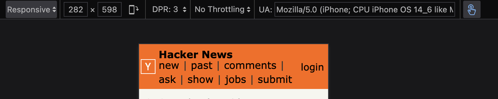

# Welcome to Hacker News Redesigned

This is a modern reincarnation of the Hacker News website. It's designed to be as accessible and responsive as possible while retaining the same familiar face and speed. It's just a prototype — meant only for viewing purposes.

This project expands on a repository I created previously that served as a proof of concept for responsive text. The current iteration extends that responsiveness to every facet of the webpage, enabling new use cases.

## Key Features

- **Ultra-responsive design:** Supports screen sizes below ~300px (Current Hacker News site gives up and returns to desktop sizing at small sizes)
- **Adaptive text handling:** Conforms to browser type standards for text resizing
- **Accessibility-first approach:** Optimized screenreader tree for effective parsing and readability
- **Improved interaction design:** Hover underlining and enhanced tab highlighting

## Purpose

This isn't meant to be a feature-rich alternative to Hacker News — those already exist in the form of wrappers and mobile apps. Instead, this project utilizes modern web standards to create a dramatically simpler, flexible, and universal front page for the site we all love.

## Examples

### Font Size Comparisons

**16px Font Size**

**18px Font Size**

**28px Font Size**

**Original at 28px Font Size**

(It looks the same at all sizes)

### Responsive Features

**Limitless Resizing**

**Link Underlining on Hover**

### Accessibility Improvements

The repository includes JSON files demonstrating the improved accessibility tree structure:
- [New Accessibility Tree](examples/new-accessibility-tree.json)
- [Old Accessibility Tree](examples/old-accessibility-tree.json)

The optimal amount of steps through the tree to get to a news item in the original is ten.
The optimal amount in this version is five.

The original also uses many more than double the amount of generic types and has zero explict ARIA naming, leaving a much more opaque trail to follow. 

## Assets

The repository includes the following assets:
- SVG files for icons (`triangle.svg`, `y18.svg`)
- HTML and CSS files for the prototype (`index.html`, `news.css`)
